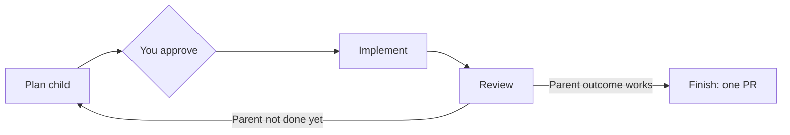

# iterate

Agent skills for building a Linear feature one child issue at a time.

A **parent issue** is the feature. A **child issue** is the next piece, small enough for one agent to finish in one session.



`/iterate-parent` runs this loop. It keeps a few rules:

- **One child at a time**, and **only you approve a child** before work starts.
- **Linear status shows where things stand** (Todo → In Progress → In Review → Done), so you can re-run after any interruption.
- **All children share the parent's branch.** Commits name their issue.
- **Proven means seen working** on the running app, with evidence saved in Linear.
- **If something is unclear or stuck, the agent stops and tells you why.**

When the parent's outcome works, `/finish-parent` reviews the whole feature, opens one PR, and moves the parent to In Review.

## Skills

| Skill | What it does |
|---|---|
| [`iterate-parent`](skills/iterate-parent/SKILL.md) | Runs the loop. |
| [`plan-sub-issue`](skills/plan-sub-issue/SKILL.md) | Drafts the next child and gets your approval. |
| [`implement-sub-issue`](skills/implement-sub-issue/SKILL.md) | Builds the child and proves it works. |
| [`review-sub-issue`](skills/review-sub-issue/SKILL.md) | Reviews and simplifies the child, then marks it Done. |
| [`finish-parent`](skills/finish-parent/SKILL.md) | Reviews the whole feature and opens the PR. |

Implement and review run as subagents when the agent supports them. Canonical files live in `skills/`; `.cursor/skills/` links to them.

## You need

- [Linear](https://linear.app) connected to the agent
- A parent issue with an outcome and Acceptance criteria
- Playwright, if a child has UI acceptance rows

## Install

From a clone, symlink `skills/` into each agent's user directory. Re-run to update; it also removes links to deleted skills.

```bash
./scripts/install-user-skills.sh
```

Targets: Grok (`~/.grok/skills`), Cursor (`~/.cursor/skills`), Claude Code (`~/.claude/skills`), Codex (`~/.codex/skills`).

From GitHub:

```bash
npx skills add thomas-silva/iterate -g -y
```
