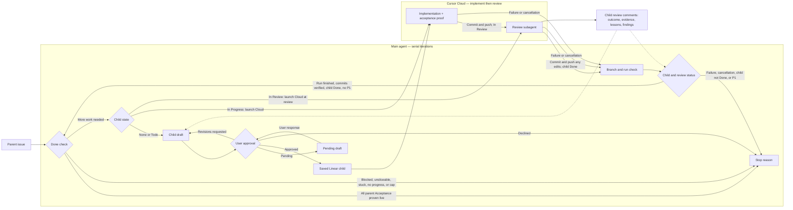

# iterate

Agent skills for one Linear child at a time, plus a parent loop that runs them.

A **parent issue** is the feature. A **child issue** is the next slice one agent can finish.

`/iterate-parent` runs one child at a time. The main agent plans here; Cursor Cloud implements and reviews.



All children of a parent share one branch — the parent's Linear git branch. Implement and review commit and push on it. No PRs.

The loop stops when the parent's Acceptance is proven live; it does not mark the parent Done. Each draft must advance unmet parent Acceptance or resolve a risk that changes what to build.

The watcher waits for the Cloud run to finish and new commits to reach the parent branch. A review-only resume can finish without new commits if the existing implementation remains on that branch. After wakeup, the main agent checks the child's state and review comments before continuing. Planning reads the latest child's review comments and relevant sibling comments.

## Skills

| Skill | What it does |
|---|---|
| [`iterate-parent`](skills/iterate-parent/SKILL.md) | Main-agent loop: done check, plan here (approval starts Cloud), wait for new commits. Cap 20. |
| [`plan-sub-issue`](skills/plan-sub-issue/SKILL.md) | Drafts the next Linear child. No code. Saves only after you approve. |
| [`implement-sub-issue`](skills/implement-sub-issue/SKILL.md) | Builds that child on the parent branch, proves frontend rows with Playwright, commits and pushes, sets In Progress then In Review. |
| [`review-sub-issue`](skills/review-sub-issue/SKILL.md) | Reviews the running system, fixes in-scope findings with simplification as a core criterion, commits and pushes, and saves evidence and remaining findings. Marks Done only when in-scope findings are resolved and acceptance passes. |
| [`implement-review-sub-issue`](skills/implement-review-sub-issue/SKILL.md) | Cloud sequencer: implement, then review as a subagent. |
| [`cursor-cloud-session`](skills/cursor-cloud-session/SKILL.md) | Grok helper: launch a Cursor Cloud agent on the current repo plus iterate to implement and review a Linear child, then wait until new commits are on the parent branch. |
| [`cursor-cloud-agents`](skills/cursor-cloud-agents/SKILL.md) | Grok helper: inspect existing Cursor Cloud agents (list, conversation, stream summary). |

Slash commands: `/iterate-parent`, `/plan-sub-issue`, `/implement-sub-issue`, `/review-sub-issue`, `/implement-review-sub-issue`. Cursor Cloud: `/cursor-cloud-session`, `/cursor-cloud-agents`.

Canonical files live in `skills/`. Cursor Cloud (and other agents that only scan the repo) load them from `.cursor/skills/`, which points at the same folders.

## You need

- [Linear](https://linear.app) with MCP connected in the agent
- A parent issue that already names an observable outcome
- Playwright, if the child has frontend acceptance rows
- `export CURSOR_API_KEY` for `/iterate-parent` and `/cursor-cloud-session`

## Install

From a clone, symlink `skills/` into each agent's user directory (re-run to upsert):

```bash
./scripts/install-user-skills.sh
```

Grok (`~/.grok/skills`), Cursor (`~/.cursor/skills`), Claude Code (`~/.claude/skills`), Codex (`~/.codex/skills`).

From GitHub:

```bash
npx skills add thomas-silva/iterate -g -y
```
