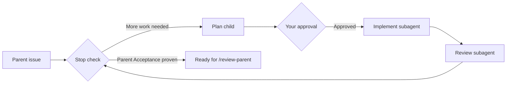

# iterate

Agent skills for building a Linear feature one child issue at a time.

A **parent issue** is the feature. A **child issue** is the next piece one agent can finish.

**Every child plan waits for your approval before any work starts.** The agent asks you in whatever way its platform allows. If it can't reach you, it stops and shows you the draft.

`/iterate-parent` runs the loop. The main agent plans each child with you, then runs implement and review as separate subagents.



Any failure (no progress, a P1 left by review, no approval) stops the loop with a reason.

All children share one branch, the parent's Linear git branch. Implement and review commit and push on it. Children do not open PRs.

Linear and that branch are the only state. If a session crashes or closes, run `/iterate-parent` again and it picks up at the right step. It runs in any agent with subagents, on your machine or in a cloud session.

When the loop finishes, `/review-parent` checks the combined feature and saves a verdict on the parent. Then `/propose-parent` opens the PR and moves the parent to In Review. Nothing marks the parent Done.

## Skills

| Skill | What it does |
|---|---|
| [`iterate-parent`](skills/iterate-parent/SKILL.md) | The loop: stop check, plan with your approval, implement subagent, review subagent. Cap 20. |
| [`plan-sub-issue`](skills/plan-sub-issue/SKILL.md) | Drafts the next child. No code. Saves only after you approve. |
| [`implement-sub-issue`](skills/implement-sub-issue/SKILL.md) | Builds the child on the parent branch, proves acceptance on the running system, pushes, sets In Review. Holds the shared proof and evidence rules. |
| [`review-sub-issue`](skills/review-sub-issue/SKILL.md) | Reviews the child on the running system, fixes in-scope findings (simplification is a core criterion), saves evidence, sets Done. |
| [`review-parent`](skills/review-parent/SKILL.md) | Reviews the whole feature and saves a ready-to-propose or blocked verdict on the parent. |
| [`propose-parent`](skills/propose-parent/SKILL.md) | Requires that verdict, then opens or updates the PR and moves the parent to In Review. |

Canonical files live in `skills/`. `.cursor/skills/` links to the same folders for agents that only scan the repo.

## You need

- [Linear](https://linear.app) connected to the agent (MCP)
- A parent issue that already names an observable outcome
- Playwright, if a child has UI acceptance rows

## Install

From a clone, symlink `skills/` into each agent's user directory. Re-run to update; it also removes links to skills that no longer exist.

```bash
./scripts/install-user-skills.sh
```

Targets: Grok (`~/.grok/skills`), Cursor (`~/.cursor/skills`), Claude Code (`~/.claude/skills`), Codex (`~/.codex/skills`).

From GitHub:

```bash
npx skills add thomas-silva/iterate -g -y
```
