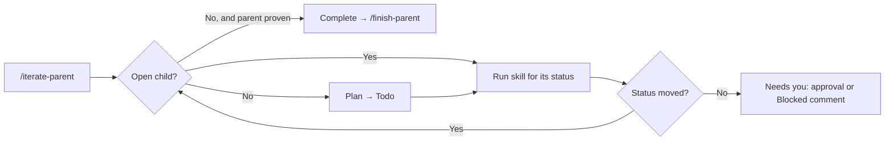

# iterate

Agent skills for building a Linear feature one child issue at a time.

A **parent issue** is the feature. A **child issue** is the next piece, small enough for one agent to finish in one session.

**Every child waits for your approval before any work starts.** The agent saves its plan as a Todo child and asks you in whatever way its platform allows. Approve by saying so, or by moving the child to In Progress yourself.

## How it works

The child's Linear status is the whole process. Each skill moves the one open child forward one step:

| Status | Meaning | Skill that moves it on |
|---|---|---|
| Todo | Draft waiting for your approval | `plan-sub-issue` → In Progress when you approve |
| In Progress | Approved; being built | `implement-sub-issue` → In Review |
| In Review | Built; being reviewed | `review-sub-issue` → Done |
| Done | Reviewed, proven, no blocking issue (P1) left | — |

If a skill can't move the child forward, it leaves the status as it is and posts a comment starting `Blocked:` explaining why.

`/iterate-parent` runs the loop: read the open child's status, run that skill, check the status moved, repeat.



It stops for one of three reasons: **Complete**, **Needs you**, or **Cap** (20 children per run by default).

All children share the parent's Linear git branch, and every commit names its issue ID. Children don't open PRs. Because Linear and that branch hold all state, you can re-run `/iterate-parent` after any crash. It runs in any agent. Implement and review run as subagents where the agent supports them, on your machine or in a cloud session.

When the loop reports Complete, `/finish-parent` reviews the whole feature, opens one PR, and moves the parent to In Review. Nothing marks the parent Done.

## Skills

| Skill | What it does |
|---|---|
| [`iterate-parent`](skills/iterate-parent/SKILL.md) | The loop described above. |
| [`plan-sub-issue`](skills/plan-sub-issue/SKILL.md) | Drafts the next child as Todo and gets your approval. No code. |
| [`implement-sub-issue`](skills/implement-sub-issue/SKILL.md) | Builds the approved child, proves it on the running system, moves it to In Review. Defines what counts as proof. |
| [`review-sub-issue`](skills/review-sub-issue/SKILL.md) | Reviews and simplifies the child, moves it to Done when proven with no P1 left. |
| [`finish-parent`](skills/finish-parent/SKILL.md) | Reviews the whole feature, opens or updates the PR, moves the parent to In Review. |

Canonical files live in `skills/`. `.cursor/skills/` links to the same folders for agents that only scan the repo.

## You need

- [Linear](https://linear.app) connected to the agent (MCP)
- A parent issue with an observable outcome and an Acceptance table
- Playwright, if a child has UI acceptance rows

## Install

From a clone, symlink `skills/` into each agent's user directory. Re-run to update; it also removes links to skills that no longer exist.

```bash
./scripts/install-user-skills.sh
```

Targets: Grok (`~/.grok/skills`), Cursor (`~/.cursor/skills`), Claude Code (`~/.claude/skills`), Codex (`~/.codex/skills`).

From GitHub:

```bash
npx skills add thomas-silva/iterate -g -y
```
